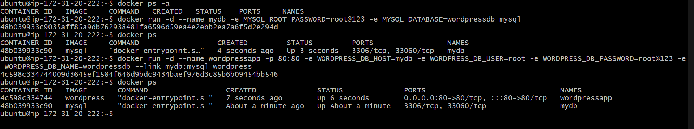
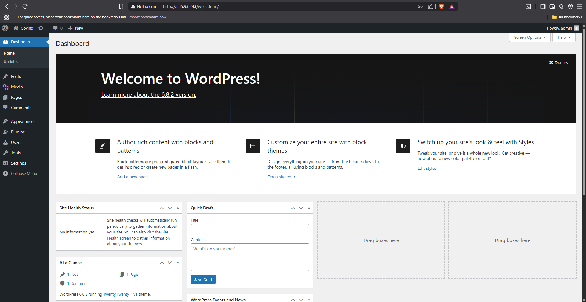

# Two-Tier Architecture with Docker (WordPress + MySQL)

This project demonstrates a simple **two-tier architecture** using Docker:

* **Tier 1 (Frontend):** WordPress
* **Tier 2 (Backend):** MySQL

The setup uses Docker containers to run both tiers and connect them together.

---

## 🛠 Commands Used

### 1. Run MySQL container

```bash
docker run -d --name mydb \
  -e MYSQL_ROOT_PASSWORD=root@123 \
  -e MYSQL_DATABASE=wordpressdb \
  mysql:latest
```

### 2. Run WordPress container

```bash
docker run -d --name wordpressapp \
  -p 80:80 \
  -e WORDPRESS_DB_HOST=mydb \
  -e WORDPRESS_DB_USER=root \
  -e WORDPRESS_DB_PASSWORD=root@123 \
  -e WORDPRESS_DB_NAME=wordpressdb \
  --link mydb:mysql \
  wordpress:latest
```

---

## ✅ Output

Once the containers are running, open your browser at:
👉 [http://localhost](http://localhost)

You’ll see the WordPress installation page, where you can set up your site.

---

## 📸 Screenshots

### Commands



### Output



---

## 📌 Notes

* Replace passwords with secure values in real-world usage.
* `--link` is **deprecated**. For production setups, prefer using **Docker networks** or **docker-compose**.
* To stop and remove the containers:

  ```bash
  docker rm -f wordpressapp mydb
  ```
* To check running containers:

  ```bash
  docker ps
  ```

---

## 📂 Project Structure

```
two-tier-wordpress-mysql/
│── README.md          # Documentation
│── .gitignore         # Ignore unwanted files
│── images/            # Screenshots
│    ├── commands.png
│    └── output.png
```

---